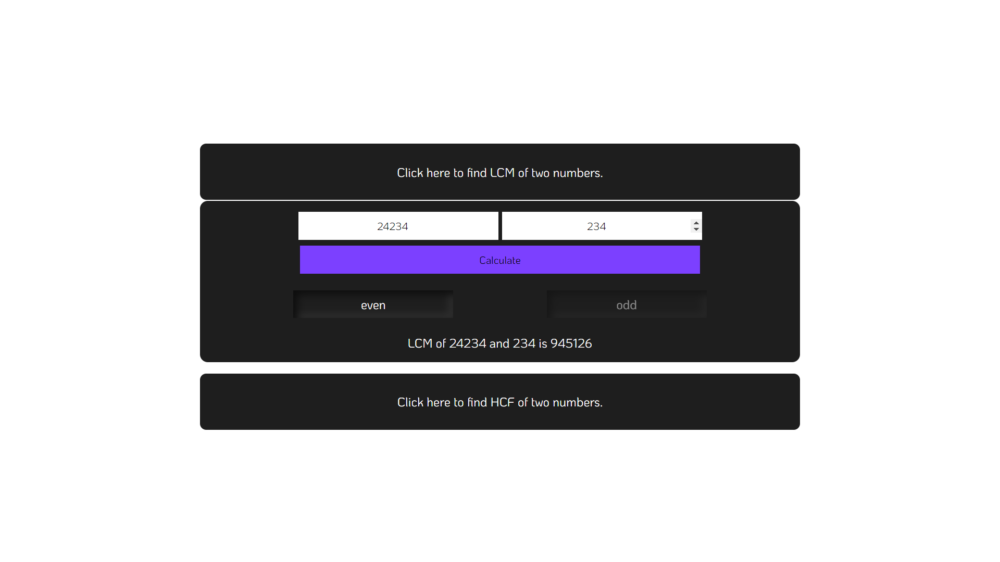
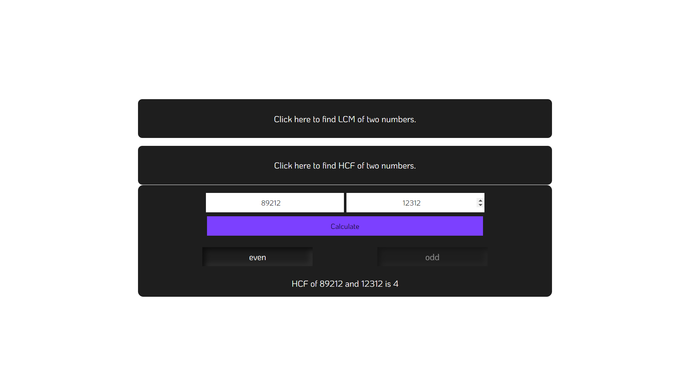

# LCM-HCF 
## HCF and LCM calculator finds the highest common factor and lowest common multiple for the given numbers.

<hr>

## Here are some screen shots

<p align="center">
  
  <br>
  
</p>

<hr>

## Built with 
 
 
 
 
 

 <hr>

## Connect with Me

[](https://github.com/Kumarswamy-palakuri)
[](https://www.linkedin.com/in/kumara-swamy-palakuri-037001208/)

Feel free to reach out and connect with me!

### How to get the clone on your local machine:

---

- Download or clone the repository

```
git clone https://github.com/Kumarswamy-palakuri/HTML-CSS-Practice.git
```


- Go to the directory
- open the terminal 
- run the following command to install node modules
```
npm install
```
- then run the following command to start the server
```
node src/app.js
```


## Happy Coding!

